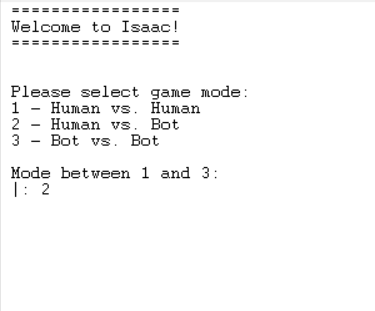
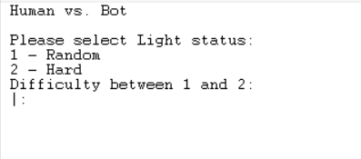
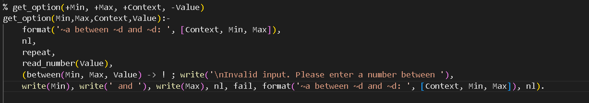
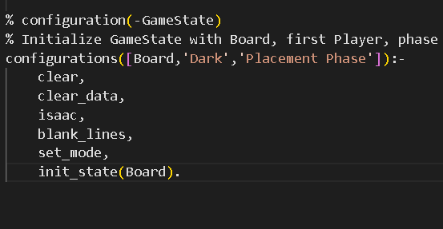
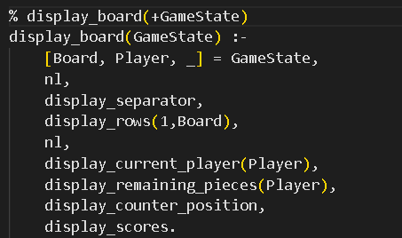
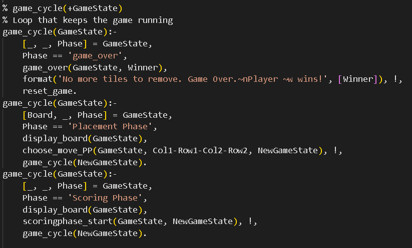
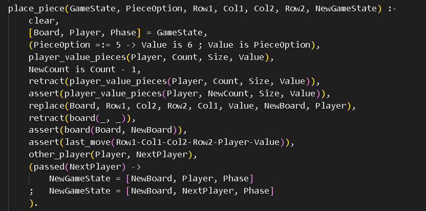
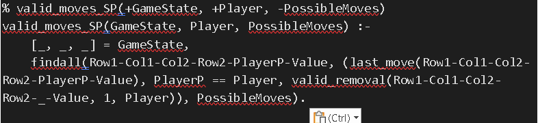

# PFL - TP1 - Isaac

## **Authors**
- [João Macedo Lima](up202108891@fe.up.pt) - up202108891
- [Tomás Eiras Silva Martins](up202108776@fe.up.pt) - up202108776
  
## **Game description**
- Isaac is played on a 10x10 board, and it has 2 phases. There are two players: Dark and Light. Each player has 15 rectangular tiles of 5 different sizes. Each tile has a score written on it.

### The placement phase (begins with an empty board)
- Starting with the Dark, players take turns placing one of their tiles per turn onto unoccupied cells of the board.
- If a player cannot put any of his remaining tiles on his turn, then he passes, and the other player puts any tiles he can.
- It ends when both players don't have space to put any of their tiles on the board. All the remaining tiles are set apart and serve the role of the tiebreaker. If both players get the same score by the end of the scoring phase, each player forms a line with all his unplayed tiles and the player with the longest line of the unplayed tiles wins the game. If the lines are of equal length, the player who started the game wins. Note that the length of each tile is not a round number of board squares but a little bit shorter.

### The scoring phase
- At the beginning both players have 0 points. To indicate this, both players put their score counter on the 00 square according to their own coordinates. If the mentioned square is under some tile, the score counter goes on top of this tile.
- The first player that passed in the Placement phase begins the Scoring phase. The players take turns removing one of their tiles from the board. The removed tile must be at least as long as any tile previously removed by the same player (e.g. if a player has previously removed a 4-cells tile then he can't remove his 3-cells tiles anymore). A player may not remove a tile lying under a score counter (of any colour).
- The result is the score earned by the removal of the tile. It indicates the maximum number of squares that the player's score counter may be moved.
- The counter can’t be placed in the same cell as the opponent's counter.
- The game ends when any player scores at least 100 points. If a player cannot remove any of his tiles on his turn, he passes and is out of the game. The game ends when both players have passed.

### End of the game 
- The game ends when a player reaches 100 points or after both players cannot remove any more tiles.

## **Game Logic**

### Internal representation of the game state

<p> This game has a 10x10 board and will be represented by a list of lists, where each list represents a row of the board. Each cell of the board is represented by a tuple of 2 elements: the first element is the colour of the tile that is on the cell, and the second element is the value of the tile that is on the cell. If there is no tile on the cell, there is no tuple and the cell will be with the following symbol ' - '. The second element (value) is connected to the value of the piece on the board as it will be described below. </p>
</p>

Possible values for the first element of the tuple:
- D (dark tile)
- L (light tile)

Possible values for the second element of the tuple and their respective length:
- 1 -> 3
- 2 -> 4
- 3 -> 5
- 4 -> 6
- 6 -> 7
  
Number of each type of tile for each player:
- 5 tiles of value 1
- 4 tiles of value 2
- 3 tiles of value 3
- 2 tiles of value 4
- 1 tile of value 6

<p>When the game board is displayed, empty cells are represented by a space with ' - '. Cells containing dark tiles are indicated by the letter 'D' followed by the tile's value, while cells with light tiles are represented by the letter 'L' followed by the tile's value. To determine whose turn it is, the current player's name will be prominently displayed at the beginning of each turn. Following the 'placement phase', players can view the remaining tiles that were not placed on the board. During the 'scoring phase', players have access to information about their counter's position on the board, and the current point totals.</p>


### Game state representation
- Placement Phase (empty board):


```pl

[['  ' , ' 9 ', ' 8 ', ' 7 ', ' 6 ', ' 5 ', ' 4 ', ' 3 ', ' 2 ', ' 1 ',' 0 ', '    |'],
 ['90',' - ',' - ',' - ',' - ',' - ',' - ',' - ',' - ',' - ',' - ', '  0 |'],
 ['80',' - ',' - ',' - ',' - ',' - ',' - ',' - ',' - ',' - ',' - ', ' 10 |'],
 ['70',' - ',' - ',' - ',' - ',' - ',' - ',' - ',' - ',' - ',' - ', ' 20 |'],
 ['60',' - ',' - ',' - ',' - ',' - ',' - ',' - ',' - ',' - ',' - ', ' 30 |'],
 ['50',' - ',' - ',' - ',' - ',' - ',' - ',' - ',' - ',' - ',' - ', ' 40 |'],
 ['40',' - ',' - ',' - ',' - ',' - ',' - ',' - ',' - ',' - ',' - ', ' 50 |'],
 ['30',' - ',' - ',' - ',' - ',' - ',' - ',' - ',' - ',' - ',' - ', ' 60 |'],
 ['20',' - ',' - ',' - ',' - ',' - ',' - ',' - ',' - ',' - ',' - ', ' 70 |'],
 ['10',' - ',' - ',' - ',' - ',' - ',' - ',' - ',' - ',' - ',' - ', ' 80 |'],
 ['0 ',' - ',' - ',' - ',' - ',' - ',' - ',' - ',' - ',' - ',' - ', ' 90 |'],
 ['  ' , ' 0 ', ' 1 ', ' 2 ', ' 3 ', ' 4 ', ' 5 ', ' 6 ', ' 7 ', ' 8 ',' 9 ', '    |']]

 |----|-----|-----|-----|-----|-----|-----|-----|-----|-----|-----|-----| 
 |    |  9  |  8  |  7  |  6  |  5  |  4  |  3  |  2  |  1  |  0  |     |
 |----|-----|-----|-----|-----|-----|-----|-----|-----|-----|-----|-----|
 | 90 |  -  |  -  |  -  |  -  |  -  |  -  |  -  |  -  |  -  |  -  |   0 |
 |----|-----|-----|-----|-----|-----|-----|-----|-----|-----|-----|-----|
 | 80 |  -  |  -  |  -  |  -  |  -  |  -  |  -  |  -  |  -  |  -  |  10 |
 |----|-----|-----|-----|-----|-----|-----|-----|-----|-----|-----|-----|
 | 70 |  -  |  -  |  -  |  -  |  -  |  -  |  -  |  -  |  -  |  -  |  20 |
 |----|-----|-----|-----|-----|-----|-----|-----|-----|-----|-----|-----|
 | 60 |  -  |  -  |  -  |  -  |  -  |  -  |  -  |  -  |  -  |  -  |  30 |
 |----|-----|-----|-----|-----|-----|-----|-----|-----|-----|-----|-----|
 | 50 |  -  |  -  |  -  |  -  |  -  |  -  |  -  |  -  |  -  |  -  |  40 |
 |----|-----|-----|-----|-----|-----|-----|-----|-----|-----|-----|-----|
 | 40 |  -  |  -  |  -  |  -  |  -  |  -  |  -  |  -  |  -  |  -  |  50 |
 |----|-----|-----|-----|-----|-----|-----|-----|-----|-----|-----|-----|
 | 30 |  -  |  -  |  -  |  -  |  -  |  -  |  -  |  -  |  -  |  -  |  60 |
 |----|-----|-----|-----|-----|-----|-----|-----|-----|-----|-----|-----|
 | 20 |  -  |  -  |  -  |  -  |  -  |  -  |  -  |  -  |  -  |  -  |  70 |
 |----|-----|-----|-----|-----|-----|-----|-----|-----|-----|-----|-----|
 | 10 |  -  |  -  |  -  |  -  |  -  |  -  |  -  |  -  |  -  |  -  |  80 |
 |----|-----|-----|-----|-----|-----|-----|-----|-----|-----|-----|-----|
 | 0  |  -  |  -  |  -  |  -  |  -  |  -  |  -  |  -  |  -  |  -  |  90 |
 |----|-----|-----|-----|-----|-----|-----|-----|-----|-----|-----|-----|
 |    |  0  |  1  |  2  |  3  |  4  |  5  |  6  |  7  |  8  |  9  |     |
 |----|-----|-----|-----|-----|-----|-----|-----|-----|-----|-----|-----|

Current player: Dark

Remaining pieces for Dark pieces player:
 -5 pieces of value 1 (size 3)
 -4 pieces of value 2 (size 4)
 -3 pieces of value 3 (size 5)
 -2 pieces of value 4 (size 6)
 -1 pieces of value 6 (size 7)

Remaining pieces for Light pieces player:
 -5 pieces of value 1 (size 3)
 -4 pieces of value 2 (size 4)
 -3 pieces of value 3 (size 5)
 -2 pieces of value 4 (size 6)
 -1 pieces of value 6 (size 7)

Counter position for Light player: (0, 0)
Counter position for Dark player: (9, 9)

Light player score: 0
Dark player score: 0
```

- Placement Phase (board with tiles):

```pl

[['  ' , ' 9 ', ' 8 ', ' 7 ', ' 6 ', ' 5 ', ' 4 ', ' 3 ', ' 2 ', ' 1 ',' 0 ', '    |'],
 ['90',' D-1 ',' D-1 ',' D-1 ',' - ',' - ',' - ',' - ',' - ',' - ',' - ', '  0 |'],
 ['80',' D-1 ',' D-1 ',' D-1 ',' - ',' - ',' - ',' - ',' - ',' - ',' - ', ' 10 |'],
 ['70',' L-2 ',' - ',' - ',' - ',' - ',' - ',' - ',' - ',' - ',' - ', ' 20 |'],
 ['60',' L-2 ',' - ',' - ',' - ',' - ',' - ',' L-6 ',' - ',' - ',' - ', ' 30 |'],
 ['50',' L-2 ',' - ',' - ',' - ',' - ',' - ',' L-6 ',' - ',' - ',' - ', ' 40 |'],
 ['40',' L-2 ',' - ',' - ',' - ',' - ',' - ',' L-6 ',' - ',' - ',' - ', ' 50 |'],
 ['30',' D-1 ',' D-1 ',' D-1 ',' - ',' - ',' L-6 ',' - ',' - ',' - ',' - ', ' 60 |'],
 ['20',' - ',' - ',' - ',' - ',' - ',' - ',' L-6 ',' - ',' - ',' - ', ' 70 |'],
 ['10',' - ',' - ',' - ',' - ',' - ',' - ',' L-6 ',' - ',' - ',' - ', ' 80 |'],
 ['0 ',' - ',' - ',' - ',' - ',' - ',' - ',' L-6 ',' - ',' - ',' - ', ' 90 |'],
 ['  ' , ' 0 ', ' 1 ', ' 2 ', ' 3 ', ' 4 ', ' 5 ', ' 6 ', ' 7 ', ' 8 ',' 9 ', '    |']]
 ```

```
 |----|-----|-----|-----|-----|-----|-----|-----|-----|-----|-----|-----| 
 |    |  9  |  8  |  7  |  6  |  5  |  4  |  3  |  2  |  1  |  0  |     |
 |----|-----|-----|-----|-----|-----|-----|-----|-----|-----|-----|-----| 
 | 90 | D-3 | D-3 | D-3 | D-3 | D-3 |  -  |  -  | D-2 |  -  | L-3 |   0 |
 |----|-----|-----|-----|-----|-----|-----|-----|-----|-----|-----|-----| 
 | 80 | L-2 | L-4 | L-4 | L-4 | L-4 | L-4 | L-4 | D-2 | D-3 | L-3 |  10 |
 |----|-----|-----|-----|-----|-----|-----|-----|-----|-----|-----|-----| 
 | 70 | L-2 | D-1 | D-3 | D-3 | D-3 | D-3 | D-3 | D-2 | D-3 | L-3 |  20 |
 |----|-----|-----|-----|-----|-----|-----|-----|-----|-----|-----|-----| 
 | 60 | L-2 | D-1 |  -  | D-2 | D-2 | D-2 | D-2 | D-2 | D-3 | L-3 |  30 |
 |----|-----|-----|-----|-----|-----|-----|-----|-----|-----|-----|-----| 
 | 50 | L-2 | D-1 | L-4 | L-4 | L-4 | L-4 | L-4 | L-4 | D-3 | L-3 |  40 |
 |----|-----|-----|-----|-----|-----|-----|-----|-----|-----|-----|-----| 
 | 40 | D-1 | D-1 | D-1 | L-2 | L-2 | L-2 | L-2 |  -  | D-3 |  -  |  50 |
 |----|-----|-----|-----|-----|-----|-----|-----|-----|-----|-----|-----| 
 | 30 | D-1 | L-1 | L-1 | L-1 | L-1 | D-3 | D-3 | D-3 | D-3 | D-3 |  60 |
 |----|-----|-----|-----|-----|-----|-----|-----|-----|-----|-----|-----| 
 | 20 | D-1 | L-1 |  -  | L-1 | L-1 | L-1 |  -  | L-1 | L-1 | D-1 |  70 |
 |----|-----|-----|-----|-----|-----|-----|-----|-----|-----|-----|-----| 
 | 10 | D-1 | L-1 | D-2 | D-2 | D-2 | D-2 |  -  | L-1 | L-1 | D-1 |  80 |
 |----|-----|-----|-----|-----|-----|-----|-----|-----|-----|-----|-----| 
 | 0  | D-6 | D-6 | D-6 | D-6 | D-6 | D-6 | D-6 | L-1 | L-1 | D-1 |  90 |
 |----|-----|-----|-----|-----|-----|-----|-----|-----|-----|-----|-----| 
 |    |  0  |  1  |  2  |  3  |  4  |  5  |  6  |  7  |  8  |  9  |     |
 |----|-----|-----|-----|-----|-----|-----|-----|-----|-----|-----|-----| 

Current player: Light

Choose a piece (value) [3-7] to move:
|- 

Choose a column [0-9] and a row [0-9] to move the piece to:
|- 

Counter position for Light player: (0, 0)
Score for Light player: 0

Counter position for Dark player: (0, 0)
Score for Dark player: 0
```

- Scoring Phase (final):
  
```pl
[[('D'-3), ('D'-3), ('D'-3), ('D'-3), ('D'-3),' - ',' - ',' - ',' - ',' - '],
 [' - ', ('L'-4), ('L'-4), ('L'-4), ('L'-4), ('L'-4), ('L'-4),' - ', ('D'-3),' - '],
 [' - ', ' - ',' - ',' - ',' - ',' - ',' - ',' - ', ('D'-3), ('L'-3)],
 [('L'-2), ('D'-1),' - ',' - ',' - ',' - ',' - ',' - ', ('D'-3),' - '],
 [' - ', ' - ', ('L'-4), ('L'-4), ('L'-4), ('L'-4), ('L'-4), ('L'-4), ('D'-3),' - '],
 [' - ', ' - ',' - ',' - ',' - ',' - ',' - ',' - ', ('D'-3),' - '],
 [' - ', ' - ', ('L'-1), ('L'-1), ('L'-1), ('D'-3), ('D'-3), ('D'-3), ('D'-3), ('D'-3)],
 [' - ', ' - ',' - ',' - ',' - ',' - ',' - ',' - ',' - ', ('D'-1)],
 [' - ', ' - ', ('D'-2), ('D'-2), ('D'-2), ('D'-2),' - ',' - ',' - ', ('D'-1)],
 [('D'-6), ('D'-6), ('D'-6), ('D'-6), ('D'-6), ('D'-6), ('D'-6),' - ',' - ', ('D'-1)]]
``` 

```

 |----|-----|-----|-----|-----|-----|-----|-----|-----|-----|-----|-----| 
 |    |  9  |  8  |  7  |  6  |  5  |  4  |  3  |  2  |  1  |  0  |     |
 |----|-----|-----|-----|-----|-----|-----|-----|-----|-----|-----|-----| 
 | 90 | D-3 | D-3 | D-3 | D-3 | D-3 |  -  |  -  |  -  |  -  |  -  |   0 |
 |----|-----|-----|-----|-----|-----|-----|-----|-----|-----|-----|-----| 
 | 80 |  -  | L-4 | L-4 | L-4 | L-4 | L-4 | L-4 |  -  | D-3 |  -  |  10 |
 |----|-----|-----|-----|-----|-----|-----|-----|-----|-----|-----|-----| 
 | 70 |  -  |  -  |  -  |  -  |  -  |  -  |  -  |  -  | D-3 | L-3 |  20 |
 |----|-----|-----|-----|-----|-----|-----|-----|-----|-----|-----|-----| 
 | 60 | L-2 | D-1 |  -  |  -  |  -  |  -  |  -  |  -  | D-3 |  -  |  30 |
 |----|-----|-----|-----|-----|-----|-----|-----|-----|-----|-----|-----| 
 | 50 |  -  |  -  | L-4 | L-4 | L-4 | L-4 | L-4 | L-4 | D-3 |  -  |  40 |
 |----|-----|-----|-----|-----|-----|-----|-----|-----|-----|-----|-----| 
 | 40 |  -  |  -  |  -  |  -  |  -  |  -  |  -  |  -  | D-3 |  -  |  50 |
 |----|-----|-----|-----|-----|-----|-----|-----|-----|-----|-----|-----| 
 | 30 |  -  |  -  | L-1 | L-1 | L-1 | D-3 | D-3 | D-3 | D-3 | D-3 |  60 |
 |----|-----|-----|-----|-----|-----|-----|-----|-----|-----|-----|-----| 
 | 20 |  -  |  -  |  -  |  -  |  -  |  -  |  -  |  -  |  -  | D-1 |  70 |
 |----|-----|-----|-----|-----|-----|-----|-----|-----|-----|-----|-----| 
 | 10 |  -  |  -  | D-2 | D-2 | D-2 | D-2 |  -  |  -  |  -  | D-1 |  80 |
 |----|-----|-----|-----|-----|-----|-----|-----|-----|-----|-----|-----| 
 | 0  | D-6 | D-6 | D-6 | D-6 | D-6 | D-6 | D-6 |  -  |  -  | D-1 |  90 |
 |----|-----|-----|-----|-----|-----|-----|-----|-----|-----|-----|-----| 
 |    |  0  |  1  |  2  |  3  |  4  |  5  |  6  |  7  |  8  |  9  |     |
 |----|-----|-----|-----|-----|-----|-----|-----|-----|-----|-----|-----| 

Current player: Dark

Counter position for Light player: (2, 4)
Score for Light player: 24

Counter position for Dark player: (2, 8)
Score for Dark player: 28

No more tiles to remove. Game ends. 
Player Dark wins!
```
**Game State Visualization**

Before initiating the game, the user(s) must configurate their match. They need to choose the mode (human/human, human/bot or bot/bot) and then the difficulty of the bots, in case the user selected one of the modes that requires a bot. There is the random and hard difficulties.
In any case, the validation of the user inputs and every possible play are secured. This is a possible interaction:





The validation of menu inputs is performed through the generic predicate 'get_option/4.' This predicate is also essential in validating coordinate inputs.



Regarding Bot players, the difficulty ('difficulty/2') is dynamically placed in the fact database to be accessible in all predicates.


Besides that, the configuration process will be automatically finished since the board has a fixed size and the initial state will be initialized. 



With the GameState initialized, we can say that the configurations process is 100% complete. After that, the board will be showed. In each iteration, this action unleashed by the predicate 'display_board/1'.



The predicate 'display_rows/2' is responsible for printing the pieces at the right coordinates. In order to generalize the relations, it is considered 'L-1' to represent the piece of value 1 from the player 'Light' and the same thing applies to the 'Dark' player.

**Move Validation and Execution**

The game works with 2 different cycles and it stops in case of someone wins or the game is over. There is one cycle for the placement phase and another one for the scoring phase.



In our choose_move/3 the player needs to inser the coordinates and all the validation occurs here (even if it is a bot or a player).

    //COLOCAR AS IMAGENS DO CHOOSE_MOVE

It is considered a valid move:
- 1 - The coordinates are inside the board
- 2 - The coordinates correspond to only vertical or horizontal lines
- 3 - Placement phase:
    - Before placing the coordinates the player can only put 'pass' (if he wants to pass the turn) or 'value' (if he wants to place a piece)
    - The cells that the piece is going to occupy are empty
    - The value indicated by the user corresponds to a piece that exists
- 4 - Scoring phase:
    - The score counter cant be placed on a position that indicates a score higher than the one that the player has at the moment
    - Can only remove pieces that are in the board
    - The user need to choose a piece that is referred in the list of pieces

After checking everything the place_piece/7 is called inside the choose_move/3 function and the piece is placed and the GameState is updated




**List of Valid Moves**

The list of valid moves is obtained using the predicate findall/3 with the objective predicate valid_moves_SP/3. Besides that, we used the find_best_move/2 to evaluate the next move for the bot with the difficulty set as 'Hard'. The other type of bot is completly random.


    

**End of Game**
In the scoring phase there is a predicate that always check if the game has reached its end (one of the players reached 100 points or there are no more possible moves for each player). This is done with the predicate winnin_condition/2, that checks if the game has ended and who won. Then, the predicate game_over/2 is called and the game ends.


**Game State Evaluation**
In our main cycle game_cycle/1, whenever the state of the game is updated it evaluates and decide the flow of the game. This bassicaly would do the same as value(+GameState, +Player, -Value). We can check wich phase the game is with the GameState and so we can always know what state we are in.


**Computer Plays**
For the bots to decide what their next move is we chose 2 methods: random and greedy. For the random method he just picks random coordinates and puts the piece in the board(placement phase) or removes from it (scoring phase).

// FOTO DAS DUAS FUNÇÕES

For the greedy method, we changed a little bit and we opted for a specific approach. During the placement phase, the bot will always put his pieces on a random way in the board. During the scoring phase, the bot searches for the move that gives him the biggest amount of points. We use the find_best_move/2 predicate for that.


**Conclusions**

We think that the Isaac game wasn't a success at all. Although we managed to implement the human vs human mode, working perfectly and in a user-friendly way, both human vs bot mode and bot vs bot mode, were implemented with some flaws. The human vs bot mode is working but the placing phase is not working in an smart way. The bot vs bot mode is not working at all and we couldn't find a way to make it work. 
We tried to implement the bot algorithm intelligently but we didn't have the time to implement a good and well structured greedy bot. We found lots of difficulties on finding a greedy strategy for the placement phase and because of that, we didn't have the time to finish the project with an algorithm that worked well in the Placement Phase. That is why we think the most challenging part of this project was the implementation of the bot. But, besides that, we were capable to do a good Player vs Player game mode and we are able to consolidate the knowledge of Prolog that we have been acquiring during the semester.

**Bibliography**

All the rules and normal behaviour of the game were consulted here:
    - https://www.youtube.com/watch?v=MwotyOed-Sw
    - https://boardgamegeek.com/filepage/61537/isaac-english-rules
